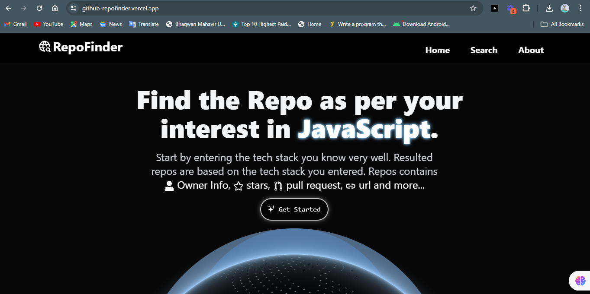
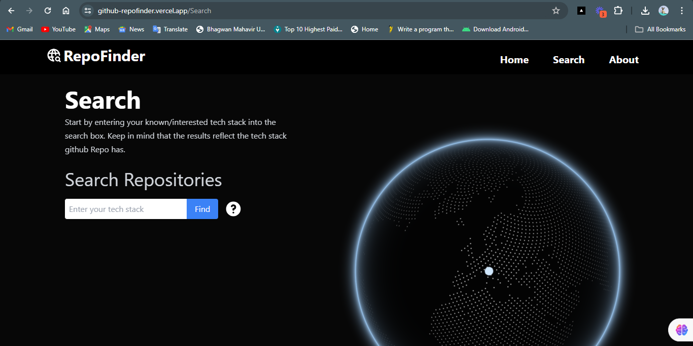
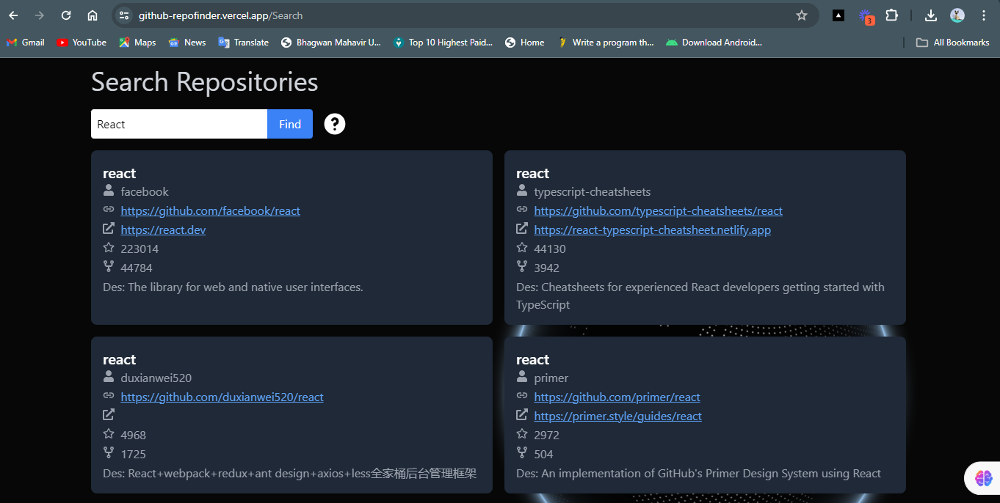
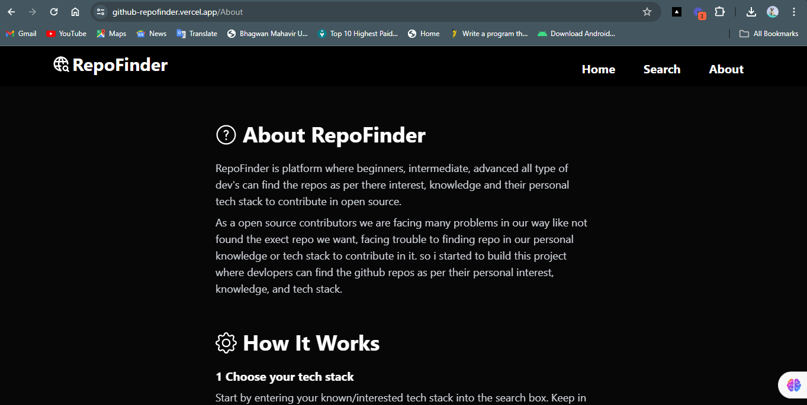
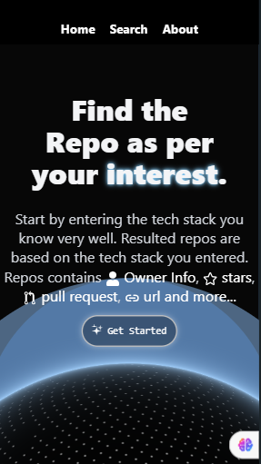
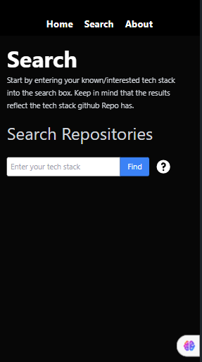
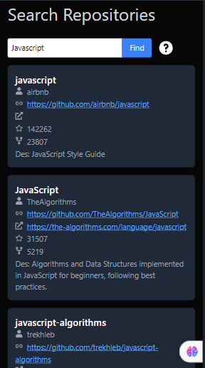
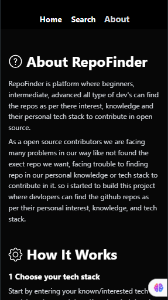

# RepoFinder

Welcome to RepoFinder! This platform is designed to help developers of all levels find repositories that match their interests, knowledge, and personal tech stack for open source contributions.

## Features

- **Tech Stack Search:** Enter your known or interested tech stack to find repositories that match your criteria.
- **Repository Insights:** View detailed information about repositories, including owner's username, repository name, star count, fork count, repository URL, live link, and description.
- **Improved Collaboration:**  Connect with project maintainers and potential contributors to foster community-driven development.

## Tech Stack

- **React.js:** Used as the frontend framework for building the user interface of the platform, providing a responsive and interactive experience.
- **Tailwind CSS:**  Used for styling the user interface, offering customizable and reusable styling classes.
- **Apollo Client:** Manages GraphQL data fetching and state management.
- **GraphQL:** Enables efficient data querying and fetching from GitHub's API.
- **Vercel:** Platform used for deployment and hosting, providing a seamless deployment process and reliable hosting services.

## Quick Start

### Demo

### Home Page


### Search Page



### About Page


### Responsive Design
<div style="overflow: auto; white-space: nowrap;">
  <a target="_blank" href="https://aryankadam.hashnode.dev/react-js-beginner-to-advanced">
    
  </a>
  <a target="_blank" href="https://aryankadam.hashnode.dev/react-js-beginner-to-advanced-series-2">
    
  </a>
  <a target="_blank" href="https://aryankadam.hashnode.dev/react-js-beginner-to-advanced">
    
  </a>
  <a target="_blank" href="https://aryankadam.hashnode.dev/react-js-beginner-to-advanced-series-2">
    
  </a>
</div>

## Getting Started

To get started with the project, follow these steps:

1. Clone the repository:
   ```
   git clone https://github.com/aryyan0701/github_repofinder.git
   ```
2. Navigate into the project directory:
   ```
   cd your_project_name
   ```
3. Install dependencies:
   ```
   npm install
   ```
4. Start the development server:
   ```
   npm run dev
   ```
5. Open your browser and visit `http://localhost:5137` to view the application.

## Usage

- Enter your tech stack in the search box to find relevant repositories.
- View detailed information about each repository, including the owner, star count, fork count, and URLs.
- Click on the "Load More" button to fetch and display additional repositories

## Contributors

- [Aryan](https://github.com/aryyan0701) - Project Lead & Developer

## License

This project is licensed under the MIT License - see the [LICENSE](LICENSE) file for details.

## Acknowledgements

- React.js community for providing a powerful frontend library for building user interfaces.
- Tailwind CSS for offering a utility-first CSS framework for rapid prototyping and styling.
- Apollo Client for efficient GraphQL data management.
- Vercel for simplifying the deployment process and providing hosting services.

## Further Help

- For more information on using React.js, Tailwind CSS, or Apollo Client, refer to their official documentation.
- If you need assistance with the project, feel free to reach out to the project lead or contributors

Thank You ..!!